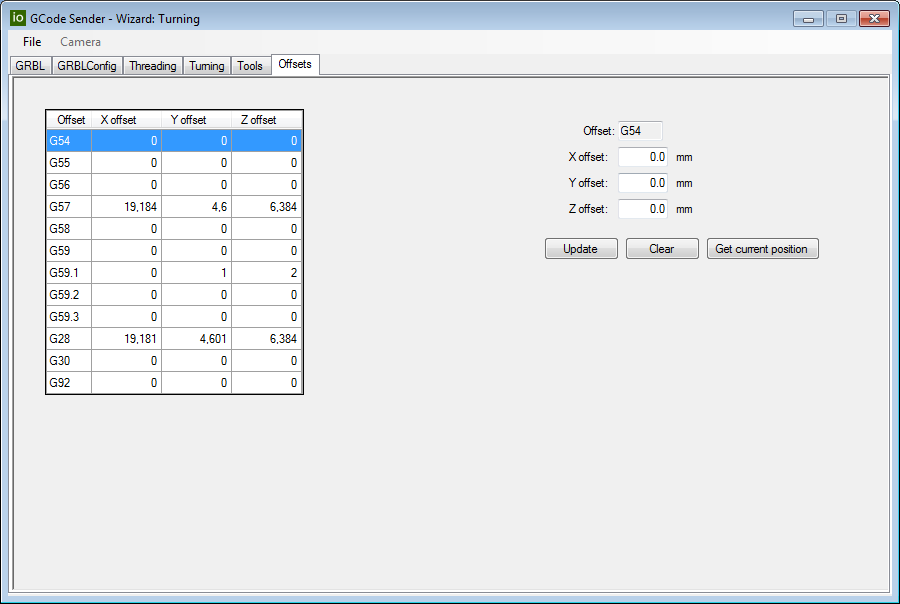
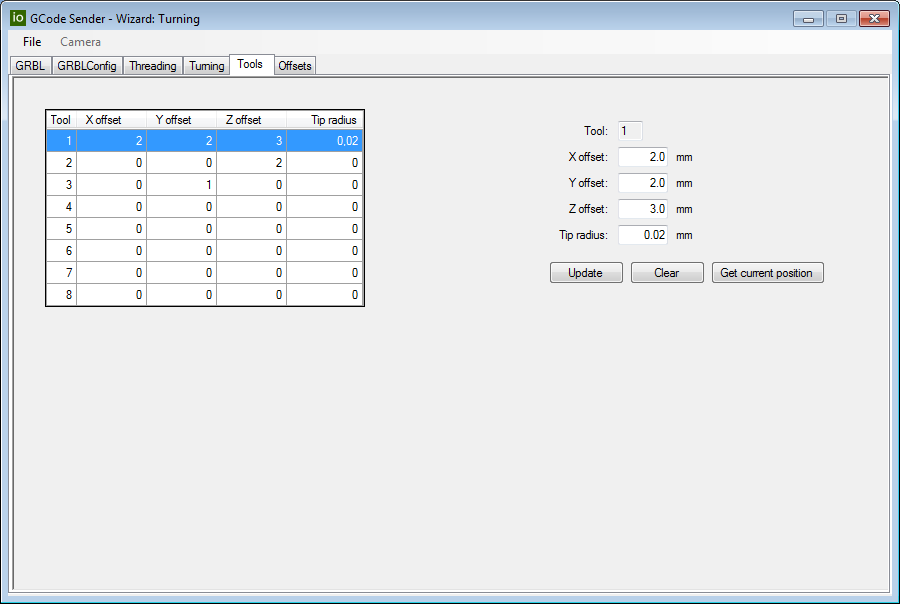
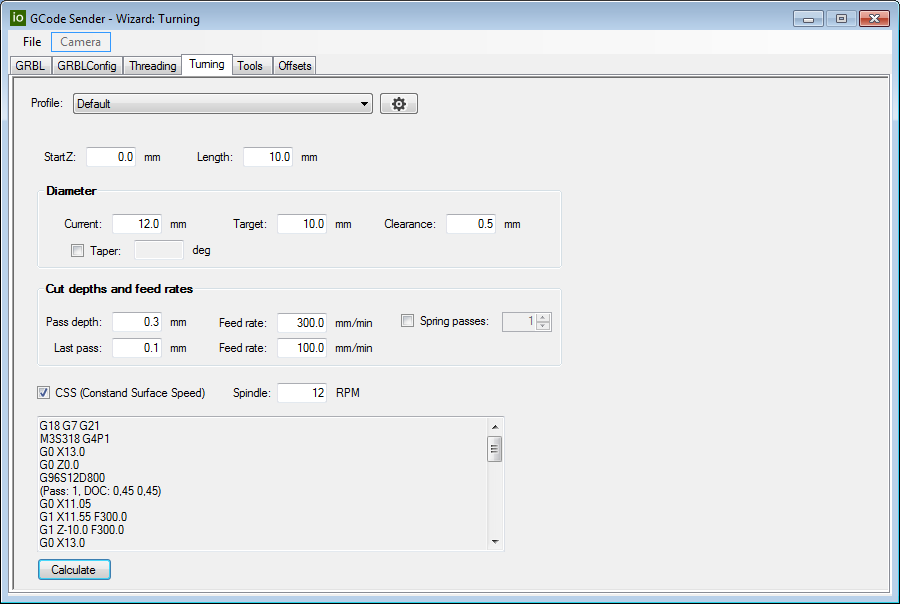
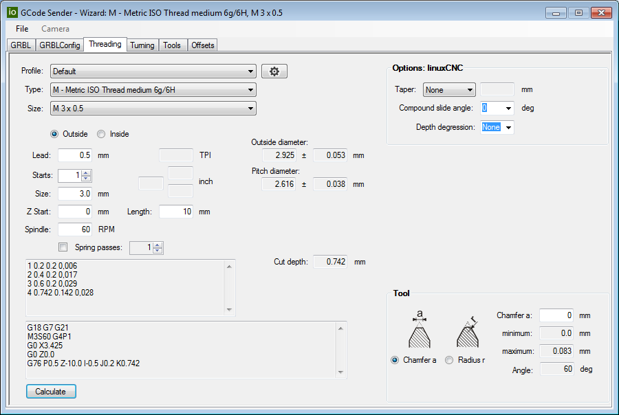
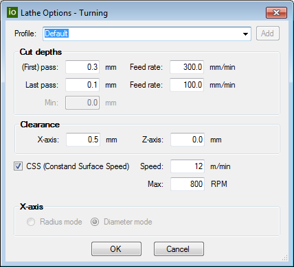
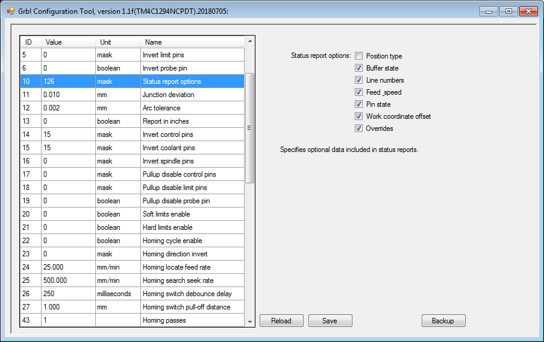
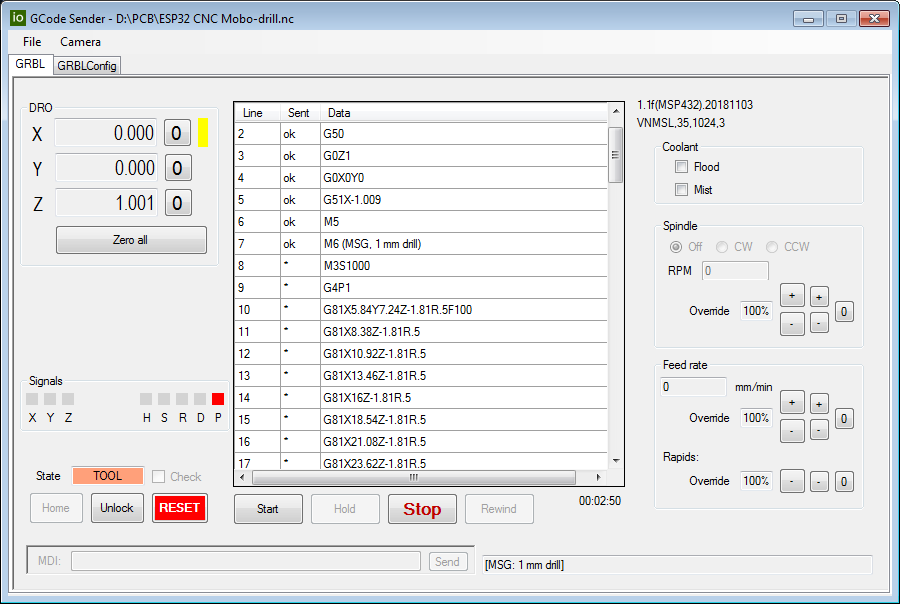
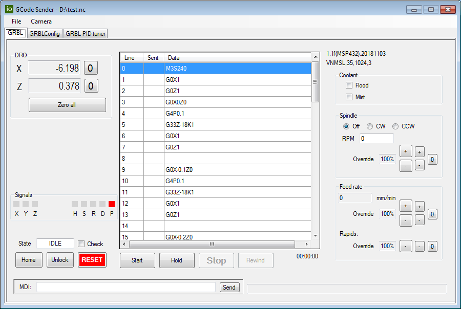
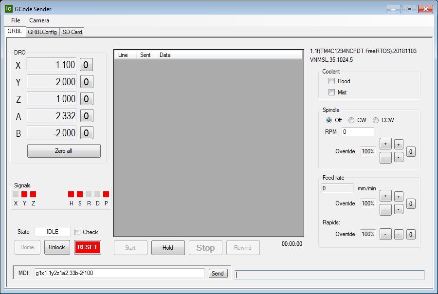
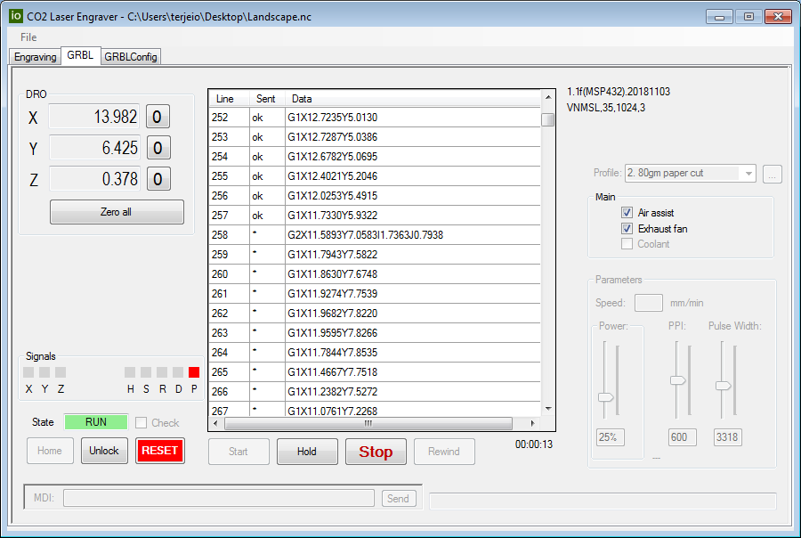

## GRBL CNC Controls

This project will most likely be archived, it is/will be superseded by the new [Grbl GCode Sender](https://github.com/terjeio/Grbl-GCode-Sender) project \(unless that fails testing\).

---

A collection of .NET controls written in C# that I use to build my GCode senders, including a camera control based on [AForge libraries](http://www.aforgenet.com/framework/downloads.html).

#### New controls added (preview version - likely to be modified, needs testing):

Offsets management (G54+).
  

GrblHAL can be configured with an internal tool table stored in EEPROM, this control can be used to manage that.
  

Turning wizard for lathes, note that vanilla grbl does not support CSS, [grblHAL](https://github.com/terjeio/grblHAL) does.
  

Threading wizard for lathes, requires a grbl port with G76 support such as [grblHAL](https://github.com/terjeio/grblHAL) compiled with a [driver](https://github.com/terjeio/grblHAL/tree/master/drivers/MSP432) supporting spindle synced motion \(under initial testing - NOT verified ok yet\).  
This wizard is based on FreeBasic code by [Stephan Brunker](https://www.sourceforge.net/p/mach3threadinghelper), ported to C# and adapted for this project.
  

For the lathe wizards profiles may be defined.
 

Lathe wizards for facing and parting are in the pipeline...

 

#### An application for configuring GRBL utilizing some of the controls is included as a separate project

The data entry fields are dynamically created according to a config file and facilitates easy configuration of GRBL.

#### Some examples of GCode senders built on top of the library:
 

For plain 3-axis mill/router with grblHAL driver supporting manual tool change.
  

For lathe with grblHAL driver supporting spindle synced motion (driver is work in progress).
  

For 5-axis configured grblHAL driver supporting SD card streaming.
  

For custom driver and controller (not published) supporting CO2 laser engraving and cutting.

---

#### NOTE:

I do not plan (for the time beeing) to release any of my GCode senders based on the controls libray. Currently I have made one for my CO2 laser, one for my mini mill/router and one for my lathe to complement the [MPG/DRO pendant](https://github.com/terjeio/GRBL_MPG_DRO_BoosterPack).
